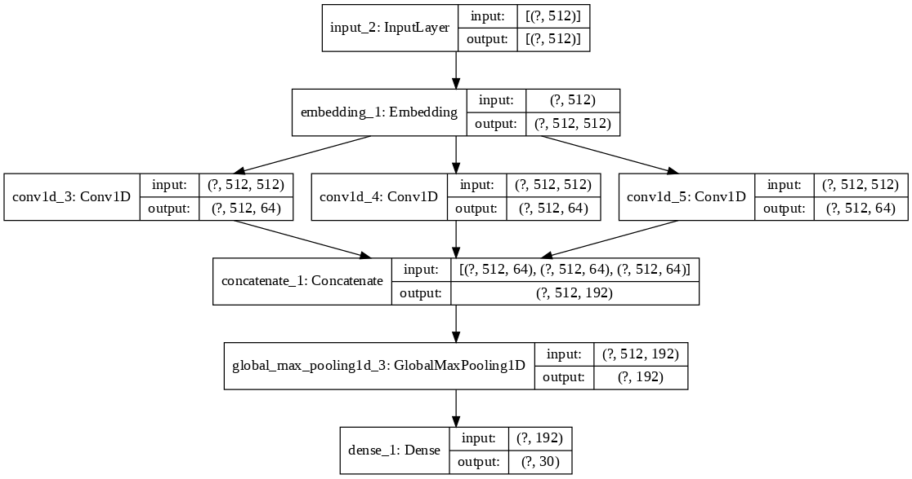

# Programming Language Classifier

The purpose of this project is to build a machine learning model that is capable of predicting the coding language given a code snippet of that language.

With the advancement and accessibility of technology, many programming languages have been developed. Similar to the differences between language of speech, each programming language has it own syntax, notations, best practices, and rules.

Natural Language Processing (NLP) has widely been used to tackle speech applications for different languages of speech. While processing of programming languages has been explored, it has not advanced to the same level. Processing programming languages presents its own challenges since the meaning of spaces, punctuations and words vary across all programming languages. For example, the word 'from' means different things in different languages, as do the punctuation marks "." and "&".

The following 30 programming [languages](languages.json) are explored in this project are: "Ada", "AWK", "C", "C++", "C#", "COBOL", "Fortran", "Go", "Groovy", "Haskell", "Java", "JavaScript", "Julia", "Kotlin", "Mathematica", "MATLAB", "Perl", "PHP", "PowerShell", "PureBasic", "Python", "R", "Racket", "Ruby", "Rust", "Scala", "SQL PL", "Swift", "UNIX Shell", "VBA"

---

## About the Dataset

The code snippets were webscraped the [scraper.py](./scraper.py) from the Rosetta Code wepage. Rosetta Code is a wiki project created by Mike Mol in 2007 that solves common tasks in a myriad of coding languages. As such, it is a useful resource to obtain code snippets with their labels. The scraper crawls across each task page and writes the name of the language and its corresponding code snippets for that given task to a CSV file (RosettaCodeData.csv).

*Note the scraper writes commas in the code snippet as the string sequence '!@#$%^&&^%$#@!'. This is done because CSV's interpret the commas as newlines, disrupting the 2-column structure within the file. The replaced sequence is complex to avoid mixing it up with any other string sequences that occur naturally in the code snippet. When preprocessing the data for classification, this string sequence is restored to commas using a string replacement.*

---

## Citations

Rosetta Code Web Page: <http://www.rosettacode.org/wiki/Rosetta_Code>

---

## Workflow

1. The data was loaded from the RosettaCodeData.csv file using Pandas library
2. The text column was preprocessing by:
    - Replacing the string sequence '!@$%%^&&^%$#@!' to commas
    - Removing all characters that are: not english, not numeric, not a punctutation mark, and spaces
3. The language column was preprocessed by:
    - label-encoding the 30 languages to a numeric representation from 0-29
    - one-hot-encoding the label-encoded language column
4. Both the text and language columns are converted to arrays
5. The text column is tokenized on a **character-level** where each character is mapped to a numeric index. Thus each observation is changed from one string to a sequence of numeric indices corresponding to each character in the string. Since punctuations, spaces and words mean different things in each language, it would be difficult to tokenize on a word level. Character-level tokenization/representation was the safest way to preserve the uniquness of each language.
6. The sequences were padded to a uniform length of 1024 since the model requires uniform input sizes.
7. The model is built using Tensorflow/Keras. It is a multi-layer convolutional neural network starting with an input layer followed by an embedding layer. The embedding layer's output is fed to 3 different ReLU-activated convolutional layers with 64 filters, but with a different filter sizes (4, 8, 16). The outputs of each of the three layers are concatenated before applying GlobalMaxPooling. Finally a softmax activated dense layer takes the output from the pooling to make a prediction. The structure is summarized below:

---

## Model Prediction

To make a prediction using the model:

1. Clone this repository from GitHub
2. Install the packages from requirements.txt

        pip install -r requirements.txt

3. Place the code snippets in the [Snippets](./Snippets) folder as .txt files. There are 4 .txt files there as examples.
4. From the command line run predict.py as follows:

        python predict.py --top 3

    *the top argument is the top N predictions to display when making a prediction*

5. Command line should print the filename and the top_n predictions for each file with their correspoding percentage for each prediction.
